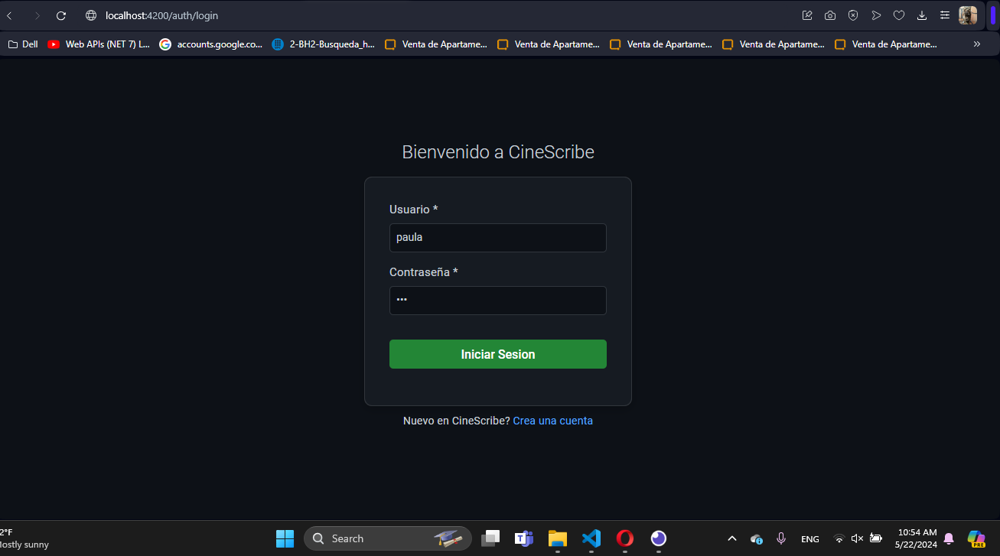
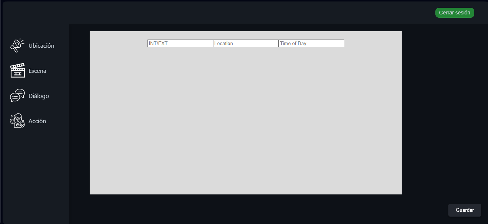
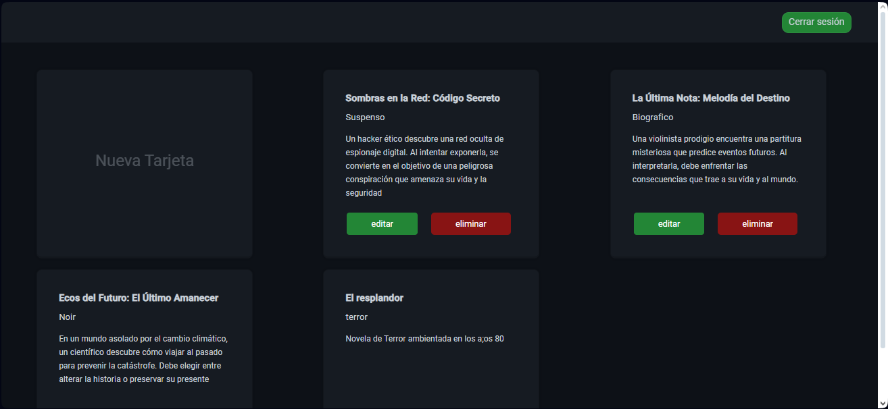
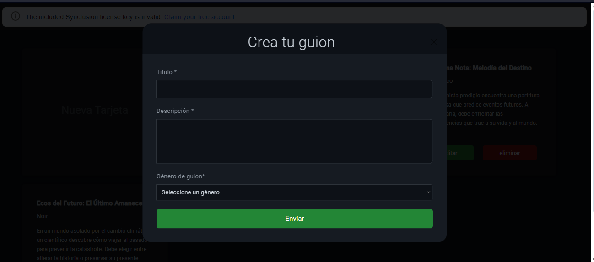
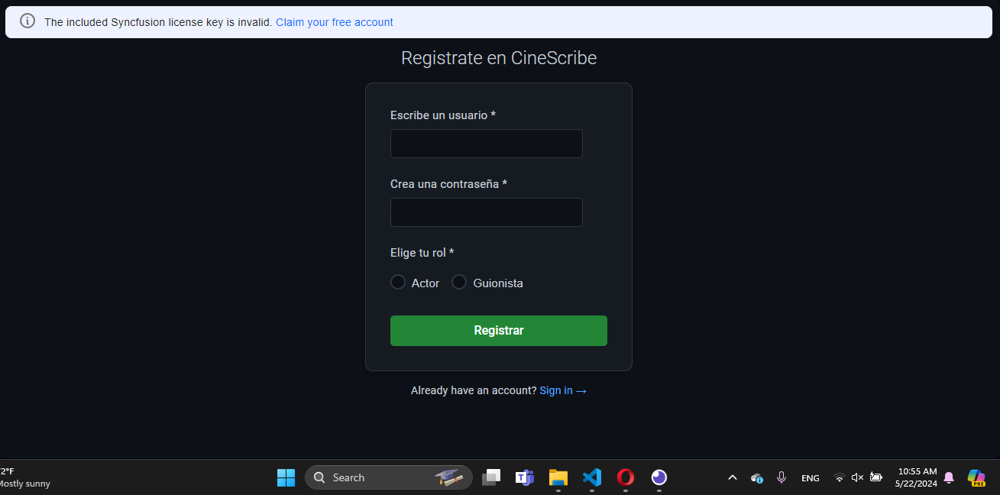

# Proyecto: Software de Gestión de Guiones para Equipos de Producción de Películas
Este repositorio contiene el código fuente y la documentación para un software diseñado para ayudar a los equipos de producción de películas a administrar y organizar sus guiones de manera eficiente.

## Requerimientos Técnicos:
1. **Autenticación y Autorización:**
Los usuarios pueden registrarse e iniciar sesión en el sistema.
Se implementa un sistema de roles para diferenciar entre Guionistas (lectura y modificación) y usuarios regulares (solo lectura).
2. **Creación de Guiones:**
Los usuarios pueden crear guiones utilizando herramientas de edición proporcionadas por el software.
Los guiones se pueden guardar en la base de datos y se les puede asignar un título y género.
3. **Gestión de Guiones:**
Los usuarios pueden visualizar y editar los guiones creados.
Se proporciona un historial de cambios para cada guion.
4. **Atributos Específicos del Guion:**
-Ubicación de los Actores: Se almacena la ubicación donde deben ubicarse los actores en cada escena del guion.
-Pose de los Actores: Se registra la pose o posición específica de los actores en cada escena del guion.
-Diálogos: Se almacenan los diálogos que deben ser dichos por los personajes en cada escena del guion.
-Tecnologías Utilizadas:
    -Desarrollo del Software:
        -Lenguaje de programación: JavaScript
        -Framework: Express.js para el backend y Angular para el frontend.
    -Bases de Datos:
        -PostgreSQL se utiliza para almacenar la información de los guiones, usuarios y otras entidades relevantes.
## Diseño de Interfaz Gráfica:
Se ha diseñado una interfaz de usuario intuitiva y atractiva que permite a los usuarios navegar fácilmente por el sistema y realizar todas las funciones requeridas.

##Imagen Login

##Imagen Editor de guiones

##Imagen Visualizador de guiones

#Imagen creacion de guiones

##Imagen del registro
